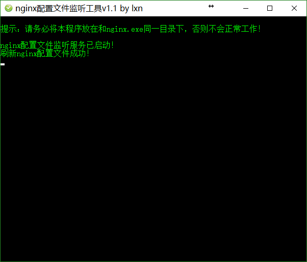

# nginx-conf-watcher

nginx配置文件监听工具

## Windows

使用方法：将`nginx-conf-watcher.exe`放入`nginx`根目录（和`nginx.exe`在同一个目录），然后双击启动即可，后续只要`conf`配置文件修改了都会自动`reload`，建议将其设置为开机自启。



## Mac

定位到 `src` 目录，然后执行：

```bash
sudo node nginx-conf-watcher-mac.js
```

注意必须确保您的nginx配置文件在`/usr/local/etc/nginx`目录。